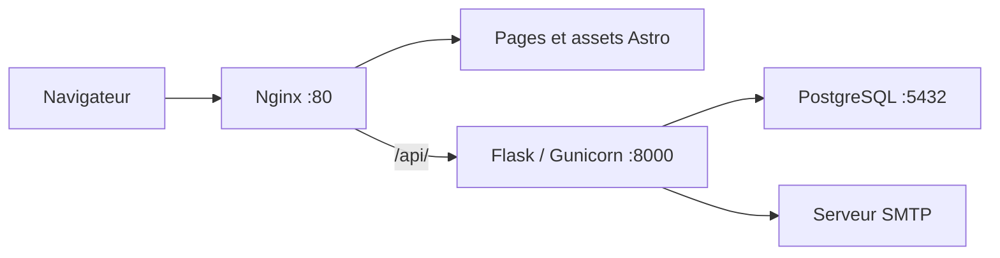

# Carte Fédé

Application de gestion des comptes, des cartes annuelles et de leur vérification pour la Fédération des étudiants FPMs.

Les utilisateurs peuvent demander un compte, demander une carte, consulter leurs cartes et afficher un QR de vérification. Les administrateurs valident les demandes, confirment les paiements, attribuent les cartes et configurent les coordonnées de paiement. L'authentification utilise les cookies de session Flask.

## Organisation

| Dossier | Rôle |
| --- | --- |
| `backend/` | API Flask, modèles SQLAlchemy, migrations SQL et scripts Python. Gunicorn écoute sur `8000`. |
| `frontend/` | Pages Astro et composants React. Le build produit des fichiers statiques dans `dist/`. |
| `nginx/` | Image de production qui construit le frontend, sert ses fichiers et transmet `/api/` à Flask. Nginx écoute sur `80`. |
| `docs/` | Description du fonctionnement et des procédures. |
| `.github/workflows/` | Publication d'image sur GHCR et mise à jour du dépôt de déploiement. |

Le Compose actuel lance **trois services** : `nginx`, `backend` et `db`. Il n'y a pas de serveur Astro ou Node en production. Le `frontend/Dockerfile` lance uniquement un serveur de développement et n'est utilisé ni par ce Compose ni par le workflow actuel.



Les appels du navigateur utilisent des chemins relatifs `/api/...`. Le site et l'API doivent donc rester accessibles sur le même domaine. Les contrôles de session dans le frontend facilitent la navigation ; Flask contrôle les droits d'accès aux données.

## Lancement local

```bash
cp .env.example .env
# Renseigner SECRET_KEY dans .env avant le lancement.
docker compose up --build
```

Le site est exposé sur `http://localhost`, l'API sur `http://localhost/api/` et son contrôle de disponibilité sur `http://localhost/api/health`. PostgreSQL et Gunicorn n'ont pas de port publié sur la machine hôte. Le volume `db_data` conserve la base.

Sur une base vide, activer temporairement `AUTO_CREATE_DB=1` pour créer les tables à partir des modèles, puis remettre la variable à `0`. Sur une base existante, appliquer les migrations dans l'ordre décrit dans [self-registration.md](docs/self-registration.md). Le démarrage ordinaire ne les applique pas.

Les cookies de session et de connexion persistante sont actuellement forcés à `Secure=True` dans `backend/app/__init__.py`. Le lancement local ne configure pas HTTPS ; le comportement de connexion en HTTP doit être adapté ou utilisé derrière un proxy HTTPS. Aucune variable d'environnement ne permet actuellement de modifier ces deux options.

Le backend est monté depuis `./backend` dans Compose. Cette configuration locale n'est pas un modèle de déploiement de production avec des images immuables.

## Workflow et déploiement

À chaque push de branche, [build.yml](.github/workflows/build.yml) :

1. Construit **uniquement le backend** depuis `backend/`.
2. Publie `ghcr.io/commission-web-fpms/carte-fede:<SHA du commit>`.
3. Utilise une GitHub App pour accéder à [carte-fede-deployment](https://github.com/Commission-Web-FPMs/carte-fede-deployment).
4. Sélectionne la branche de même nom dans ce dépôt, ou la crée depuis `main`.
5. Modifie `image.tag` dans `values.yaml`, puis y pousse un commit `deploy: <SHA>`.

Le workflow ne lance pas Docker Compose et ne déploie pas directement sur Kubernetes. L'application de ce commit dépend du contrôleur GitOps configuré dans le cluster. Une branche de déploiement créée par le workflow ne crée pas, à elle seule, un environnement.

Le chart Helm consulté sur `main` le 9 octobre 2026 décrit un seul conteneur backend sur `8000`. Il ne contient ni frontend/Nginx ni PostgreSQL. Le workflow et ce chart doivent évoluer ensemble pour déployer le site complet.

Le détail des composants, les incohérences relevées et la proposition pour les images, ports et accès se trouvent dans [architecture.md](docs/architecture.md).

## Vérifications disponibles

Le backend contient `backend/tests/test_requests.py`, qui utilise une base PostgreSQL jetable et recrée ses tables. Son garde-fou exige une URL locale sur le port `15432`. Le frontend contient des scripts dans `frontend/scripts/` pour les requêtes, le chargement des pages, les sessions, l'interface mobile et le cache du service worker. Certains nécessitent Playwright et un site lancé séparément.

Ces vérifications ne sont pas exécutées par le workflow actuel. Le script `npm run build` exécute `astro check` puis `astro build`, mais le workflow actuel ne construit pas le frontend.

## Licence

Libre pour un usage personnel ou associatif. À compléter pour la redistribution.
