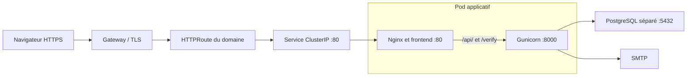

# Fonctionnement et déploiement

## Frontend

`frontend/src/pages/` définit les URLs. Les pages publiques incluent l'accueil, la connexion, l'inscription et la réinitialisation du mot de passe. Les cartes sont affichées sur `/cartes`, le QR sur `/app/qr`, l'administration sur `/admin/...` et le scanner sur `/verif`.

`src/layouts/Layout.astro` contient la structure commune. `src/components/` contient les interfaces interactives React. `src/lib/current-user.ts` partage les appels simultanés à `/api/me`, puis revalide la session lors des appels suivants. `src/lib/admin-users.ts` rassemble des appels API et des helpers pour les années académiques.

Astro utilise `output: "static"`. Les pages sont construites avant le déploiement et les composants chargent les données dans le navigateur. Les cookies sont envoyés à l'API sur le même domaine. La protection visuelle des pages ne remplace pas les contrôles Flask.

`frontend/public/` contient le manifeste PWA, le service worker et les assets publics. Le service worker peut conserver des pages et assets pour le mode hors ligne, mais les requêtes `/api/` passent par le réseau.

La configuration conserve des éléments issus d'un autre déploiement : adaptateur et métriques Vercel, ancien hôte de développement dans `vite.config.js`, nom de package `site-fpms`. Ils restent à simplifier si Docker/Kubernetes devient la seule cible. Le fichier de verrouillage npm est conservé.

## Backend et données

`backend/wsgi.py` appelle `create_app()` dans `backend/app/__init__.py`. Cette fonction configure Flask, SQLAlchemy, Flask-Login et les blueprints actifs.

| Module | Responsabilité |
| --- | --- |
| `models.py` | Comptes et rôles, cartes annuelles, demandes en attente, paramètres de paiement et modèles de salles/votes. |
| `routes_auth.py` | Connexion par matricule ou email, session, inscription, changement et réinitialisation du mot de passe. |
| `routes_admin.py` | Gestion des comptes, validation des demandes, paramètres de paiement et routes administratives de salles/votes. |
| `routes_memberships.py` | Cartes par année, demandes de carte, attribution de numéros, QR signés et vérification. |
| `card_payment.py` | Coordonnées de paiement et QR de virement EPC. Le QR n'effectue pas un paiement. |
| `email_utils.py`, `password_reset.py` | Envoi SMTP et jetons de réinitialisation signés. |

Une inscription crée une demande temporaire, pas un compte actif. L'administrateur valide le compte, puis traite la demande de carte. Une carte n'existe qu'après son attribution. PostgreSQL conserve les comptes, les cartes et les demandes ; les mots de passe sont hashés.

Les modèles et routes administratives de salles/votes existent encore. Le blueprint `routes_rooms.py` n'est pas enregistré dans `create_app()`. Supprimer ou terminer cette fonctionnalité demande une décision fonctionnelle, car ses modèles peuvent correspondre à des données existantes.

Les fichiers de `backend/migrations/` sont des migrations SQL manuelles. Ils ne constituent pas un gestionnaire de migrations automatique et leur ordre n'est pas l'ordre alphabétique :

1. `20261002_pending_requests.sql`.
2. `20261002_non_umons_registration.sql`.
3. `20261002_card_payment.sql`.

Le script `backend/scripts/create_admin.py` utilise un email et un mot de passe fixes. Il doit être adapté avant un usage en production.

## Construction et réseau actuels

`nginx/Dockerfile` utilise le dépôt racine comme contexte. Il installe les dépendances npm avec `npm ci`, construit Astro, puis copie `frontend/dist/` dans une image Nginx. Node intervient pendant la construction uniquement.

`backend/Dockerfile` utilise `backend/` comme contexte et lance Gunicorn avec trois workers. Les dépendances Python ne sont pas verrouillées à des versions précises, contrairement aux dépendances npm.

| Service Compose | Port interne | Accès depuis la machine hôte |
| --- | --- | --- |
| `nginx` | `80` | `80:80` |
| `backend` | `8000` | Aucun port publié. Nginx contacte `backend:8000`. |
| `db` | `5432` | Aucun port publié. Flask utilise `DATABASE_URL`. |

Les en-têtes de cache distinguent les assets Astro versionnés des pages et fichiers publics à revalider. Nginx limite aussi les inscriptions et la génération de QR de paiement par adresse IP.

Deux incohérences doivent être corrigées avant le déploiement complet :

- Le QR de carte encode `/verify?token=...`, une route HTML Flask. Nginx ne transmet actuellement que `/api/` à Flask ; `/verify` tombe donc dans le routage statique. Il faudra transmettre exactement `/verify` au backend, ou changer explicitement le parcours du QR pour utiliser `/verif`.
- Les cookies Flask sont forcés en HTTPS. Le HTTPS public et la transmission de son protocole jusqu'à Flask doivent être cohérents. `ProxyFix` fait confiance à un niveau de `X-Forwarded-Proto` et `X-Forwarded-Host` ; il faut définir qui fournit ces en-têtes dans la chaîne Gateway/Nginx.

## Lien entre les deux dépôts

Le dépôt d'application contient le code et les Dockerfiles. Le dépôt [Commission-Web-FPMs/carte-fede-deployment](https://github.com/Commission-Web-FPMs/carte-fede-deployment) contient un chart Helm, ses valeurs et les templates Kubernetes. C'est le nom utilisé par le workflow actuel, plutôt que `carte-fede-deploy`.

Le workflow publie le backend sous un tag SHA, puis modifie le tag du chart dans la branche correspondante. Le token `GITHUB_TOKEN` sert à GHCR ; le token de la GitHub App sert à écrire dans le dépôt de déploiement. La GitHub App doit être installée sur ce dépôt avec le droit d'écriture sur son contenu. Les noms des dépôts GHCR sont convertis en minuscules.

Il n'y a pas d'étape de test dédiée, de migration SQL ou d'application Kubernetes dans ce workflow. Il n'y a pas non plus de construction de `nginx/Dockerfile`. Une modification purement frontend pousse donc actuellement une nouvelle image backend sans publier le frontend modifié.

La lecture du `main` distant le 9 octobre 2026 montre :

- [Un Deployment avec un seul conteneur](https://github.com/Commission-Web-FPMs/carte-fede-deployment/blob/main/templates/deployment.yaml), utilisant `image.repository` et `image.tag`.
- [Un Service](https://github.com/Commission-Web-FPMs/carte-fede-deployment/blob/main/templates/service.yaml) dont `service.port` vaut `8000` et cible le port nommé `http`.
- [Une HTTPRoute](https://github.com/Commission-Web-FPMs/carte-fede-deployment/blob/main/templates/httproute.yaml) qui cible ce Service. Les valeurs par défaut ont `hostnames: []`, `rules: []` et un parent `public` dans `traefik`, section `http`. Ces valeurs seules ne définissent pas une route utilisable vers le site ; vérifier les éventuelles surcharges du contrôleur GitOps.
- `envFrom: []`, prévu pour injecter la configuration et les secrets, et aucune ressource PostgreSQL dans ce chart.

Les valeurs effectives, le domaine, le Gateway, la base de données et la configuration du contrôleur GitOps dans le cluster n'ont pas été inspectés. La lecture du chart ne prouve donc pas l'état du déploiement actif.

## Adaptation proposée

Pour commencer, un Deployment contenant **deux conteneurs applicatifs dans le même Pod** limite les changements du chart. PostgreSQL reste un service distinct avec sa propre persistance. Nginx et Flask sont alors redéployés et répliqués ensemble. Deux Deployments séparés restent possibles si leur mise à l'échelle doit devenir indépendante.

Les conteneurs d'un même Pod partagent le réseau. Nginx doit donc joindre Gunicorn sur `127.0.0.1:8000`, pas sur le nom Compose `backend`. Voir la [documentation Kubernetes sur le réseau des Pods](https://kubernetes.io/docs/concepts/workloads/pods/#pod-networking).

L'adaptation doit couvrir les points suivants dans les deux dépôts :

1. **Publier deux images pour le même SHA.** Conserver `ghcr.io/commission-web-fpms/carte-fede:<SHA>` pour le backend et ajouter, par exemple, `ghcr.io/commission-web-fpms/carte-fede-web:<SHA>` pour le build racine utilisant `nginx/Dockerfile`. Mettre à jour le dépôt GitOps seulement quand les deux publications ont réussi.
2. **Ajouter le conteneur web au chart.** Garder `image` pour le backend afin de conserver le contrat actuel du workflow, et ajouter une section `web.image`. Le workflow devra modifier les deux tags. Les ports des conteneurs doivent être explicites, indépendants de `service.port` : `web-http=80`, `api-http=8000`.
3. **Exposer le web.** Passer le Service à `80`, avec `targetPort: web-http`. L'HTTPRoute cible ce Service, avec le domaine prévu et une règle `PathPrefix: /`. Le port `8000` ne nécessite pas de Service public. Le serveur Astro de développement et son HMR ne sont pas nécessaires en production.
4. **Configurer Nginx pour chaque environnement.** Prévoir un template Nginx ou une configuration montée depuis le chart pour choisir l'upstream. Compose conserve `backend:8000` ; le Pod partagé utilise `127.0.0.1:8000`. Conserver les limites de requêtes, les règles de cache et le préfixe `/api/`, puis corriger le routage de `/verify`.
5. **Injecter la configuration uniquement dans Flask.** Utiliser `envFrom` pour les Secrets/ConfigMaps du backend. Renseigner `DATABASE_URL` avec l'adresse réelle de PostgreSQL, `SECRET_KEY`, `FRONTEND_BASE_URL` et les paramètres SMTP. Garder la même `SECRET_KEY` entre workers, réplicas et redéploiements pour conserver les sessions et les jetons. Ne pas injecter les secrets PostgreSQL/SMTP dans Nginx ou le build Astro.
6. **Définir le HTTPS et les adresses clientes.** Attacher l'HTTPRoute au listener approprié du Gateway. La section actuelle `http` ne suffit pas à démontrer un accès HTTPS. Configurer les en-têtes transmis et les proxies de confiance ; sinon les liens absolus peuvent utiliser HTTP et les limites par IP peuvent traiter toutes les requêtes comme venant du Gateway.
7. **Prévoir disponibilité et accès réseau.** Ajouter des probes propres à chaque conteneur : disponibilité web et `/api/health` côté backend. Ce dernier vérifie que Flask répond, pas que la base est disponible. En cas de NetworkPolicy, permettre le trafic Gateway vers Nginx ainsi que les sorties du backend vers PostgreSQL, SMTP et DNS. Prévoir `imagePullSecrets` si GHCR est privé.
8. **Préparer la base avant la bascule.** Utiliser PostgreSQL existant ou le provisionner séparément avec stockage persistant et sauvegardes. Appliquer les migrations nécessaires avant la nouvelle version et conserver `AUTO_CREATE_DB=0` sur une base existante. Le chart actuel ne crée pas la base.
9. **Encadrer les mises à jour GitOps.** Vérifier les branches surveillées et leurs namespaces. Sérialiser les écritures par branche pour éviter que deux runs concurrents écrasent ou rejettent leurs mises à jour. Une nouvelle branche ne doit pas réutiliser accidentellement les données de production.

Cette adaptation est une proposition. Le nettoyage de ce dépôt ne change ni les images publiées, ni les ports, ni le chart distant.

## Nettoyage effectué et suites possibles

Les anciennes sauvegardes `.bak`, les fichiers générés `frontend/.astro/`, le helper SSR inutilisé `src/lib/auth.js` avec son appel à `localhost:3000` et le composant sans référence `MembershipTable.tsx` ont été retirés. Git ignore les sauvegardes et la génération Astro. Les contextes Docker excluent les fichiers d'environnement et les caches locaux. `.env.example` décrit la configuration attendue sans fournir de secrets.

Le découpage `backend/`, `frontend/`, `nginx/` est conservé : il correspond aux responsabilités actuelles. Déplacer ces dossiers n'apporterait pas de simplification et obligerait à modifier les contextes Docker et le workflow.

Les prochains nettoyages possibles demandent de choisir ou de vérifier leur comportement : regrouper la configuration de développement Astro/Vite, retirer Vercel si cette cible est abandonnée, fusionner l'ancienne page `/app/cartes` avec `/cartes` en préservant les liens existants, puis décider du devenir des salles/votes. Le backend pourrait aussi séparer les routes administratives de ces salles du module de gestion des comptes. Ces éléments restent en place.

Le nettoyage n'a pas fait l'objet de tests, de build ou de validation du chart.
