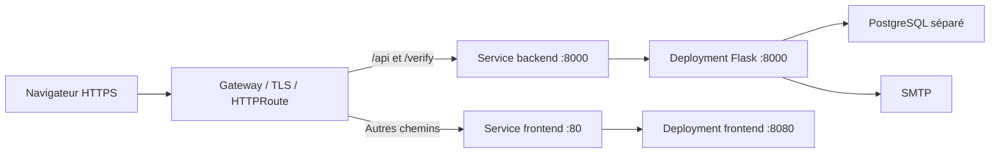

# Fonctionnement et déploiement

## Composants

`frontend/src/pages/` définit les pages. Le layout commun est dans `src/layouts/`, les interfaces React dans `src/components/` et les appels partagés dans `src/lib/`. Le frontend vérifie la session pour afficher les interfaces ; Flask contrôle les droits d'accès aux données.

Astro utilise `output: "static"`. Les composants chargent les données dans le navigateur. Le service worker conserve des pages et assets pour le mode hors ligne, mais les requêtes `/api/` passent par le réseau.

`backend/wsgi.py` appelle `create_app()`, qui configure Flask, SQLAlchemy, Flask-Login et les blueprints actifs.

| Module backend | Responsabilité |
| --- | --- |
| `models.py` | Comptes et rôles, cartes, demandes, paramètres de paiement et modèles de salles/votes. |
| `routes_auth.py` | Connexion, session, inscription et mots de passe. |
| `routes_admin.py` | Comptes, validation des demandes, paiements et routes administratives de salles/votes. |
| `routes_memberships.py` | Cartes par année, demandes, numéros, QR signés et vérification. |
| `card_payment.py` | Coordonnées de paiement et QR EPC, sans exécuter le virement. |
| `email_utils.py`, `password_reset.py` | SMTP et jetons de réinitialisation signés. |

Une inscription crée une demande temporaire. L'administrateur valide le compte, puis traite la demande de carte. Une carte n'existe qu'après son attribution. PostgreSQL conserve ces données et les mots de passe hashés.

Les modèles et routes administratives de salles/votes sont conservés. Le blueprint `routes_rooms.py` n'est pas enregistré dans `create_app()`. Leur suppression nécessite de décider du devenir de la fonctionnalité et des données.

## Images et variables d'environnement

`backend/Dockerfile` installe les dépendances Python et lance Gunicorn sous un UID non-root. `PORT` vaut 8000 et `WEB_CONCURRENCY` vaut 3 par défaut. `GUNICORN_CMD_ARGS` permet de fournir des options supplémentaires.

Flask exige `DATABASE_URL` et `SECRET_KEY`. Il lit les paramètres SMTP, `FRONTEND_BASE_URL`, les durées des jetons et les options de cookies depuis l'environnement. Garder la même clé de signature entre workers, réplicas et redéploiements. En production HTTPS, les cookies restent sécurisés par défaut.

`PROXY_FIX_X_FOR`, `PROXY_FIX_X_PROTO`, `PROXY_FIX_X_HOST`, `PROXY_FIX_X_PORT` et `PROXY_FIX_X_PREFIX` indiquent le nombre de proxies de confiance pour chaque en-tête. Les défauts font confiance à un proxy pour l'IP, le protocole et l'hôte. Les paramètres doivent correspondre à la chaîne réelle de proxies.

`frontend/Dockerfile` utilise `npm ci`, construit Astro, puis copie les fichiers dans Nginx. `PORT` vaut 8080 par défaut. Aucun serveur Node ne tourne dans le conteneur final.

Le build utilise une origine de substitution `https://runtime.invalid`. `scripts/prepare-runtime.mjs` crée des templates pour les pages, sitemaps et robots.txt contenant cette origine. Au démarrage, `nginx/40-runtime-url.sh` les remplit avec la variable publique `FRONTEND_BASE_URL`, et le mécanisme standard de l'image Nginx renseigne le port d'écoute. Les scripts et les appels API ne sont pas réécrits.

L'image frontend conserve l'origine de production comme défaut. Pour un autre environnement, injecter son origine HTTP ou HTTPS, sans chemin ni paramètres. Ne pas transmettre les secrets du backend au frontend.

Les dépendances Python restent non verrouillées. Les dépendances npm utilisent le fichier de verrouillage existant. Les dépendances Vercel restent dans les manifests, mais l'adaptateur a été retiré de la configuration Astro pour construire directement les fichiers statiques.

## Routage Kubernetes

Deux Deployments permettent de gérer séparément les réplicas et les ressources. Les sélecteurs du backend existant sont conservés. Le frontend a un nom et des sélecteurs distincts, pour éviter que l'ancien Service ou Deployment le sélectionne.

Les deux Services sont des ClusterIP. Le port Service du frontend, 80, cible son port conteneur nommé `http`, 8080 par défaut. Les ports des Services sont indépendants des ports des conteneurs. Le chart injecte automatiquement `PORT` pour aligner chaque processus sur son port conteneur.

L'HTTPRoute conserve le préfixe `/api`. Elle transmet aussi exactement `/verify` à Flask, ce qui répare le parcours des URLs encodées dans les QR. La page scanner `/verif` reste une page du frontend.

Le Gateway, ses certificats et les autorisations `allowedRoutes` sont fournis par l'infrastructure. Adapter les noms du Gateway, de son namespace, de ses listeners et le domaine dans les valeurs Helm. Les variables d'environnement d'un Pod ne peuvent pas configurer une HTTPRoute déjà créée par Kubernetes.

Les limites d'inscription et de QR de paiement sont transférées à deux middlewares Traefik via des filtres `ExtensionRef`. Le chart les active par défaut. La CRD Middleware et le provider `kubernetesCRD` de Traefik sont nécessaires. Les limites s'appliquent par instance Traefik et utilisent par défaut l'IP du client direct. Configurer la stratégie IP si un autre proxy précède Traefik.

Les probes contrôlent `/api/health` et `/_health`. Elles vérifient que les processus répondent ; le contrôle Flask ne teste pas la base. En cas de NetworkPolicy, autoriser le Gateway vers les deux applications et Flask vers PostgreSQL, SMTP et DNS.

## Compose local

Compose conserve un proxy local pour offrir un seul domaine sur `http://localhost`. Il lance quatre services : `nginx`, `frontend`, `backend` et `db`. Ce proxy sert uniquement au lancement local et n'est ni publié par le workflow ni déployé par le chart.

`nginx/Dockerfile` utilise le contexte racine et copie seulement la configuration du proxy. Celle-ci envoie les pages au frontend sur 8080, et `/api/` ainsi que `/verify` à Flask sur 8000. Les limites de requêtes locales sont conservées ; les en-têtes de cache viennent du frontend.

Le backend reçoit `.env` et conserve le montage local du code. Le frontend reçoit seulement `FRONTEND_BASE_URL` et son port, sans les secrets PostgreSQL/SMTP. `.env.example` configure les cookies pour HTTP local ; fournir une clé de signature avant le lancement.

## Publication et dépôt GitOps

Le dépôt [carte-fede-deployment](https://github.com/Commission-Web-FPMs/carte-fede-deployment) contient le chart et ses valeurs. Le workflow d'application construit et publie les deux images avec le même SHA. Il modifie les deux tags seulement quand les publications ont réussi. Les exécutions d'une même branche sont sérialisées.

La GitHub App écrit dans la branche GitOps correspondant à la branche source, créée depuis `main` si nécessaire. Le token de publication GHCR et celui de la GitHub App ont des rôles distincts. Le contrôleur GitOps doit surveiller la bonne branche et le bon namespace pour qu'un commit entraîne un déploiement.

Le script de mise à jour des images préserve les autres valeurs. Il accepte aussi l'ancien chart en ajoutant le bloc d'image frontend aux valeurs ; ce bloc est utilisé après intégration des nouveaux templates.

Le chart accepte les variables et références à des Secrets/ConfigMaps existants via `env` et `envFrom`. Le backend conserve les clés racine pour compatibilité ; le frontend utilise ses propres listes. Aucun secret applicatif, serveur PostgreSQL ou administrateur n'est créé.

Le chart adapté est livré dans une PR du dépôt de déploiement. Son intégration reste distincte de la publication des images. La configuration effective du cluster n'a pas été inspectée.

## Base de données et suites possibles

Les migrations sont manuelles et doivent précéder le rollout sur une base existante :

1. `20261002_pending_requests.sql`.
2. `20261002_non_umons_registration.sql`.
3. `20261002_card_payment.sql`.

Garder `AUTO_CREATE_DB=0` en production. PostgreSQL doit être provisionné séparément avec stockage persistant et sauvegardes. Le script de création d'administrateur utilise encore des identifiants fixes et doit être adapté avant un usage en production.

Les prochains nettoyages possibles concernent la configuration de développement Astro/Vite, les dépendances Vercel inutilisées, l'ancienne page `/app/cartes` et la fonctionnalité de salles/votes.
